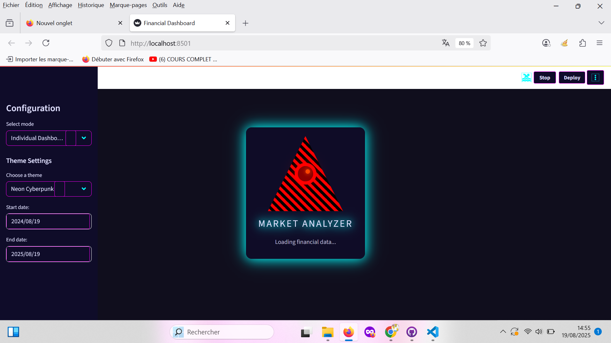
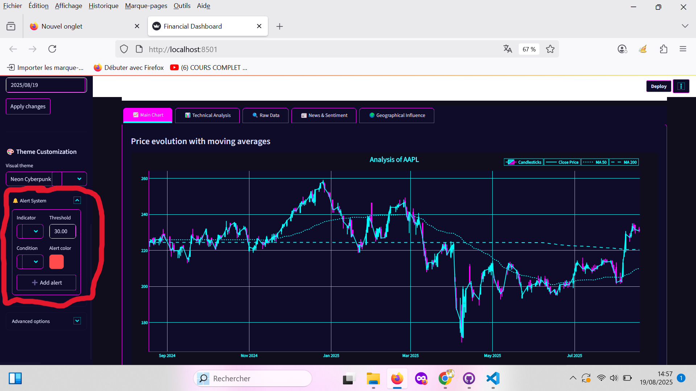
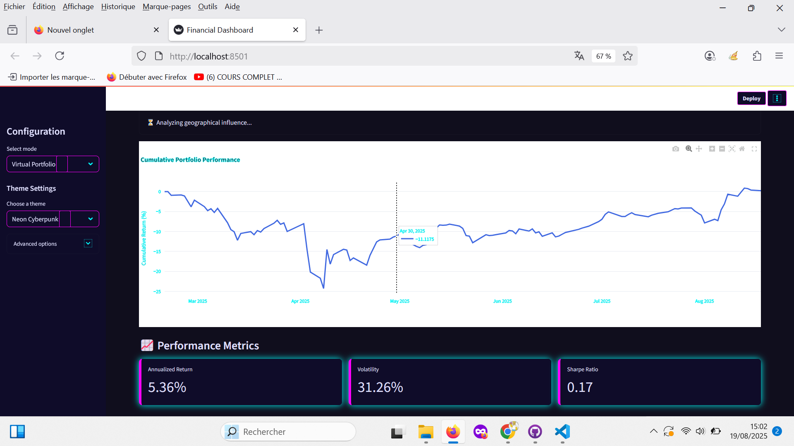
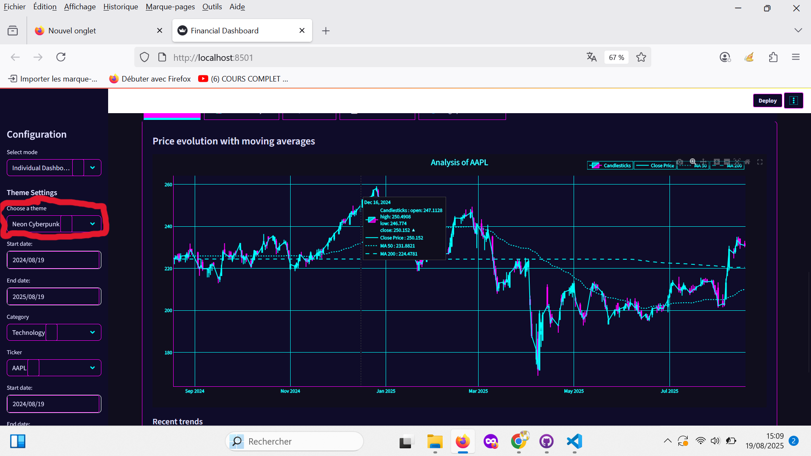

# 📊 Financial Dashboard - Market Analyzer

Application Streamlit complète d'analyse de marchés financiers avec visualisation technique, gestion de portefeuille et analyse de sentiment.



## ✨ Fonctionnalités principales

- **Tableaux de bord individuels** :
  - Analyse technique (MA, RSI, Bollinger Bands)
  - Visualisations interactives (Plotly)
  
  - Alertes personnalisables
  
- **Comparaison multi-actifs** :
  - Analyse comparative entre plusieurs tickers
  
  
  - Téléchargement asynchrone des données
  
- **Portefeuille virtuel** :
  - Simulation de portefeuille multi-actifs
  - Analyse de performance et risque
  
  
  
  - Cartographie géographique des expositions
  
- **Analyse de marché** :

  - Sentiment Reddit (simulé)
  
  - Actualités financières
  
  - Contexte macroéconomique
  
- **Personnalisation** :
  - 7 thèmes visuels différents
  - Système de couleurs global
  
  
  
  
  
  
  

  ## ⚙️ Installation

1. **Cloner le dépôt** :
```bash
git clone https://github.com/BuyukHasan/bourse_dashboard
cd bourse_dashboard

2. **Créer un environnement virtuel** : 
python -m venv venv
source venv/bin/activate  # Linux/Mac
venv\Scripts\activate    # Windows

3. **Installer les dépendances** :
pip install -r requirements.txt

4. **Lancer l'application** :
streamlit run app.py

🚀 Utilisation
Modes disponibles
Dashboard individuel : Analyse technique d'un actif

Comparaison multi-actifs : Comparaison de plusieurs instruments

Portefeuille virtuel : Simulation de stratégie d'investissement

Tests unitaires : Validation des modules

Commandes utiles
Ctrl+C : Arrêter l'application

Clear cache : Bouton dans la sidebar pour rafraîchir les données

🧩 Structure des fichiers
text
financial-dashboard/
├── app.py                # Point d'entrée principal
├── requirements.txt      # Dépendances
├── .gitignore
├── asset_categories.py   # Classement des actifs par secteur
├── css.py                # Gestion des thèmes visuels
├── dashboard.py          # Module principal du dashboard
├── data_fetcher.py       # Récupération des données (yfinance)
├── geo_data.py           # Données géographiques
├── macro_data.py         # Données macroéconomiques
├── news_fetcher.py       # Collecte d'actualités
├── portfolio_manager.py  # Gestion de portefeuille
├── reddit_analyzer.py    # Analyse de sentiment (simulé)
├── technical_analyzer.py # Calculs d'indicateurs techniques
└── visualizer.py         # Visualisations graphiques

🛠 Dépendances clées
streamlit==1.47.0 - Interface web

yfinance==0.2.65 - Données financières

plotly==6.2.0 - Visualisations interactives

pandas==2.3.0 - Manipulation de données

numpy==2.2.2 - Calculs scientifiques

🤝 Contribution
Les contributions sont bienvenues ! Process recommandé :

Forker le projet

Créer une branche : git checkout -b feature/nouvelle-fonctionnalite

Commiter vos changements : git commit -m 'Ajout d'une super fonction'

Pousser vers la branche : git push origin feature/nouvelle-fonctionnalite

Ouvrir une Pull Request

📜 Licence
Ce projet est sous licence MIT - voir le fichier LICENSE pour plus de détails.


