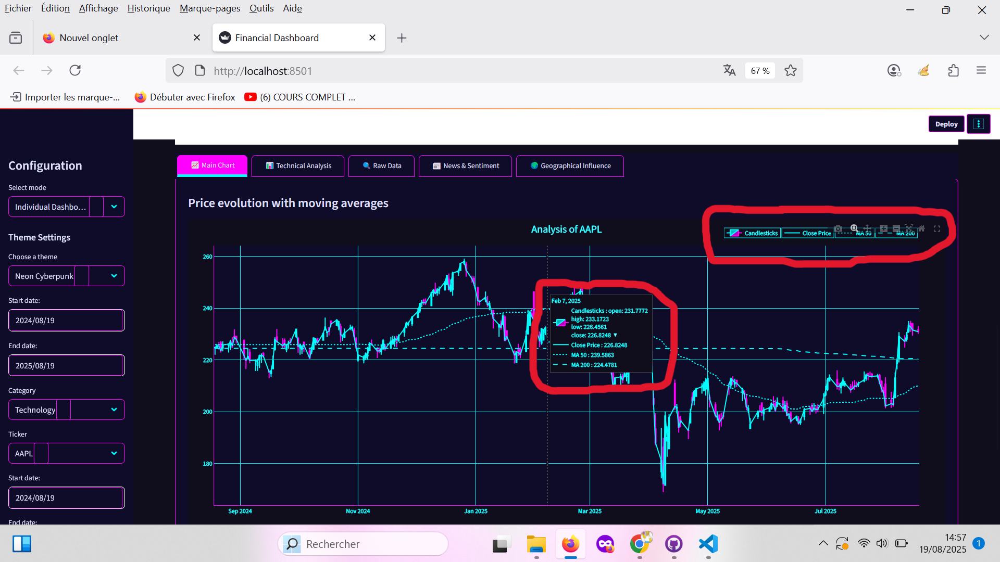
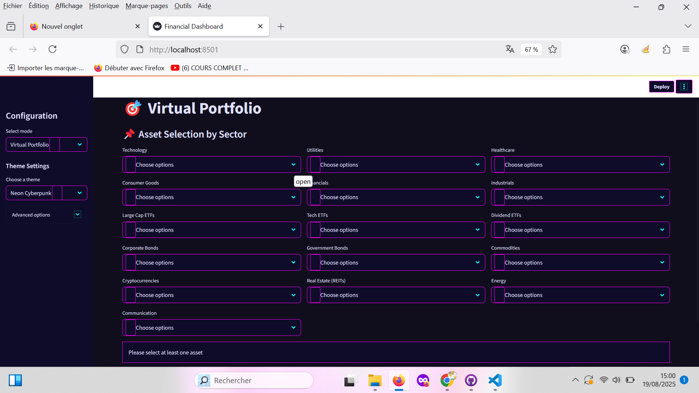
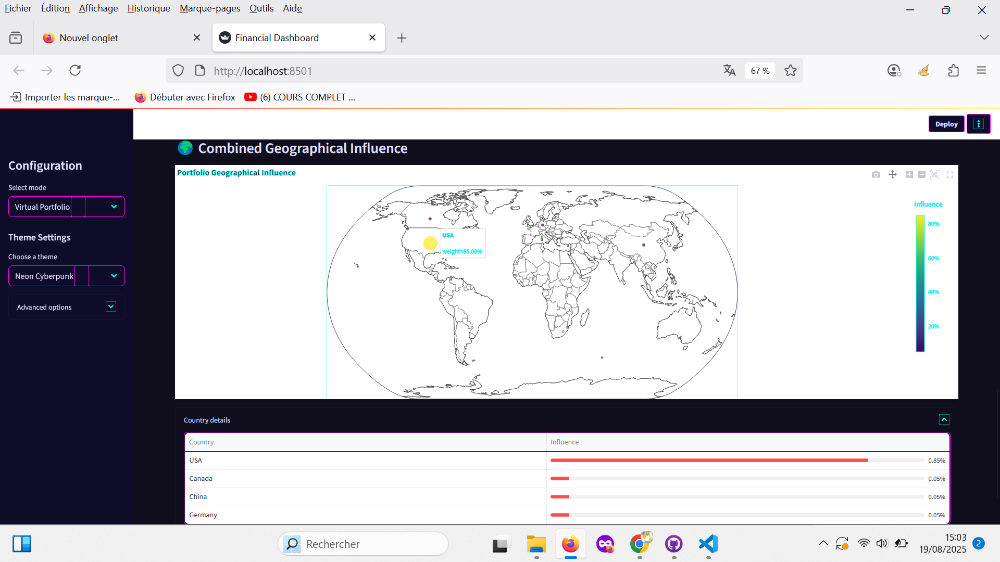
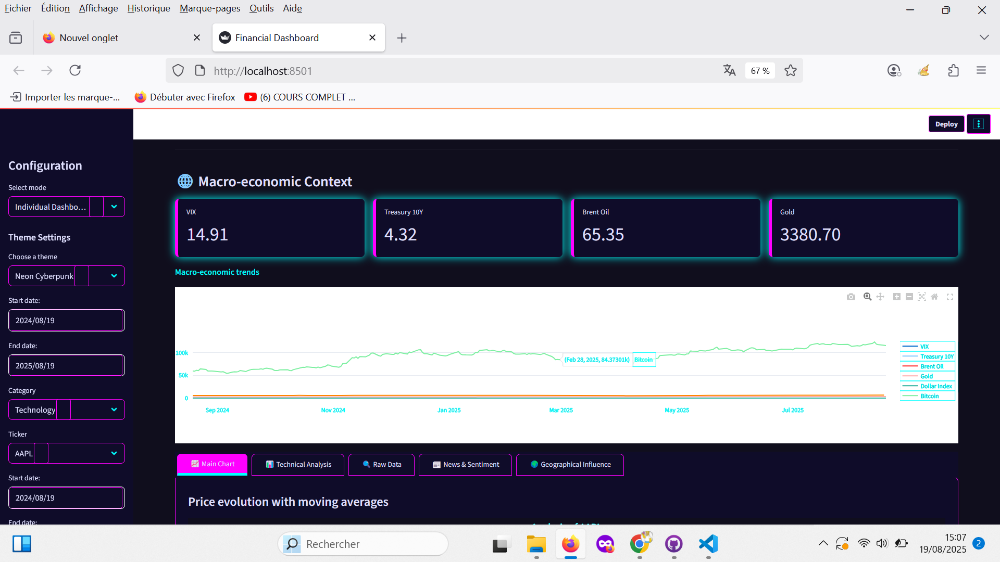
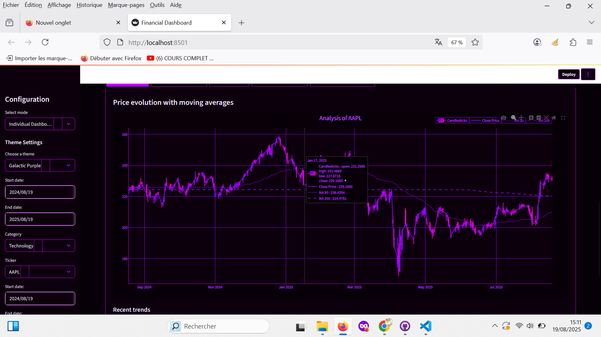
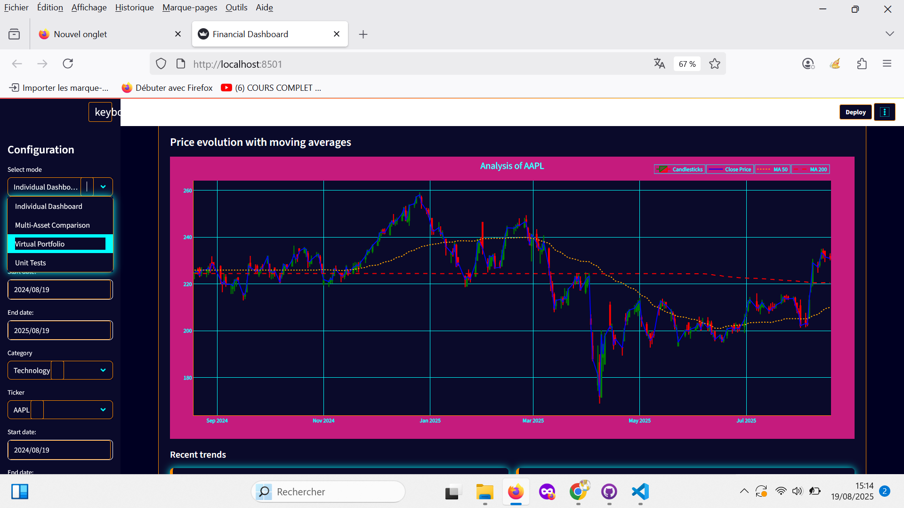

# 📊 Financial Dashboard - Market Analyzer

Complete Streamlit application for financial market analysis with technical visualization, portfolio management, and sentiment analysis.


## ✨ Main features

### 📈 Individual dashboards
Advanced technical analysis (MA, RSI, Bollinger Bands) with interactive Plotly visualizations



### 🔍 Multi-asset comparison
Comparative analysis and asynchronous data download


### 💼 Virtual portfolio
Multi-asset portfolio simulation, performance/risk analysis and geographical mapping




### 📰 Market analysis
Reddit sentiment (simulated), financial news and macroeconomic context




### 🎨 Advanced customization
7 unique visual themes to customize the interface

**Neon Cyberpunk** :


**Lava Explosion** :


**Electric Ocean** :


**Acid Jungle** :


**Galactic Purple** :


**Retro Dark** :


**Crypto Fever** :


# Installation

1. **Clone the repository** :
```bash
git clone https://github.com/BuyukHasan/bourse_dashboard
cd bourse_dashboard
```

2. **Create a virtual environment** :
```bash
python -m venv venv
source venv/bin/activate  # Linux/Mac
venv\Scripts\activate    # Windows
```

3. **Install the dependencies** :
```bash
pip install -r requirements.txt
```

4. **Launch the application** :
```bash
streamlit run app.py
```

## 🚀 Usage

### Available modes
- **Individual dashboard** : Technical analysis of an asset
- **Multi-asset comparison** : Comparison of multiple instruments
- **Virtual portfolio** : Investment strategy simulation
- **Unit tests** : Module validation



### Useful commands
- **Rerun** : Button `r`(from the dashboard)
- **Clear cache**: Button `c` then confirm the instruction on the page (from the dashboard)
- **Stop application**: Control + `c` (from the terminal where you launched `streamlit run app.py`)

## 🧩 File structure

```
financial-dashboard/
├── app.py                # Main entry point
├── requirements.txt      # Dependencies
├── .gitignore
└── src/                  # Folder containing all the project classes
    ├── asset_categories.py   # Asset classification by sector
    ├── css.py                # Visual theme management
    ├── dashboard.py          # Main dashboard module
    ├── data_fetcher.py       # Data retrieval (yfinance)
    ├── geo_data.py           # Geographical data
    ├── macro_data.py         # Macroeconomic data
    ├── news_fetcher.py       # News collection
    ├── portfolio_manager.py  # Portfolio management
    ├── reddit_analyzer.py    # Sentiment analysis (simulated)
    ├── technical_analyzer.py # Technical indicator calculations
    └── visualizer.py         # Graph visualizations
```

## 🛠 Main Dependencies

- **streamlit==1.47.0** - Web interface
- **yfinance==0.2.65** - Financial data
- **plotly==6.2.0** - Interactive visualizations
- **pandas==2.3.0** - Data manipulation
- **numpy==2.2.2** - Scientific calculations

## 🤝 Contribution

Contributions are welcome! Recommended process:

1. **Forker** the project
2. **Create a branch** : `git checkout -b feature/new-feature`
3. **Commit your changes** : `git commit -m 'Add an awesome feature'`
4. **Push to the branch** : `git push origin feature/new-feature`
5. **Open a Pull Request**

## 📜 Licence

This project is licensed under the MIT License. See the LICENSE file for details.

> **Note** : While the MIT license is permissive, an email notification (buyukh7723@gmail.com) is appreciated for significant reuse. I generally accept as long as I am notified.


